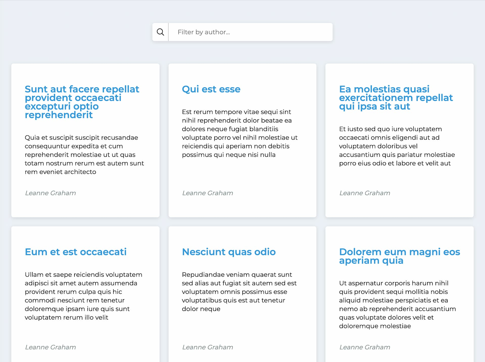

# Список постов

Функционал: загрузка постов по API и фильтрация по имени с задержкой ввода

---
### Используемые технологии
- React
- Typescript
- Redux, Redux Toolkit
- Axios
- CSS Modules
 ---
### Ссылка на опубликованную версию:
https://pestrige.github.io/post-list/

---
### Превью:

---
### Инструкции:
1. Клонируйте репозиторий на локальную машину:
~~~
git clone git@github.com:pestrige/post-list.git
~~~
2. Перейдите в папку проекта:
~~~
cd post-list
~~~
4. Установите зависимости:
~~~
yarn install
~~~
5. Запустите проект командой:
~~~
yarn start
~~~

